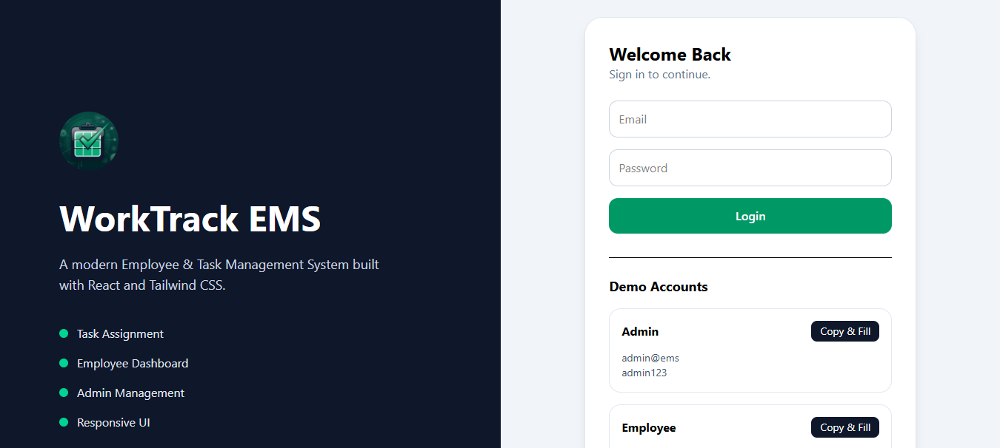
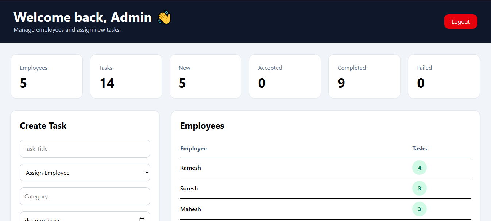
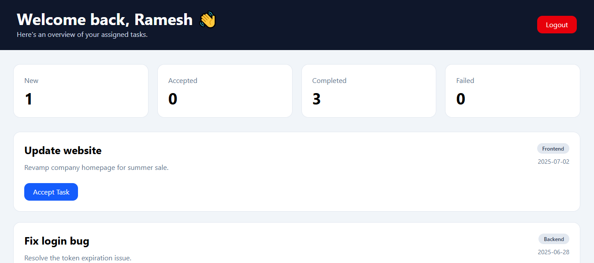
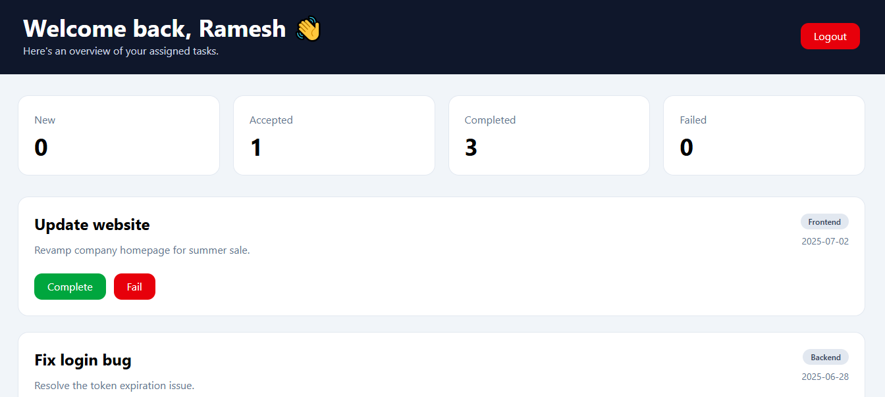
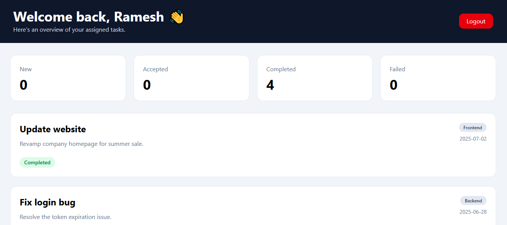

# 🚀 WorkTrack EMS

<p align="center">


</p>

A modern **Employee Management System (EMS)** built with **React**, **Tailwind CSS** and **Context API**. WorkTrack EMS provides role-based dashboards for administrators and employees, allowing task assignment, task tracking and status management through a clean, responsive interface.

> Designed as a frontend-focused project demonstrating modern React development, responsive UI design, state management and role-based authentication.

---

## ✨ Features

### 👑 Admin Dashboard

* Secure admin login
* Create and assign tasks
* View all employees
* Track total tasks
* Monitor task status

  * New
  * Accepted
  * Completed
  * Failed
* Responsive dashboard
* Toast notifications

### 👤 Employee Dashboard

* Secure employee login
* View assigned tasks
* Accept tasks
* Mark tasks as completed
* Mark tasks as failed
* Personal task statistics
* Responsive interface

### 🎨 UI Highlights

* Modern SaaS-inspired design
* Fully responsive layout
* Emerald & Slate theme
* Dashboard cards
* Professional badges
* Clean typography
* Mobile friendly
* Toast notifications

---

## 🛠 Tech Stack

* **React**
* **Vite**
* **Tailwind CSS**
* **React Router**
* **Context API**
* **React Hot Toast**
* **Local Storage**

---

## 📂 Project Structure

```text
src
├── components
│   ├── Admin
│   ├── Employee
│   └── Auth
├── context
├── utils
├── App.jsx
└── main.jsx
```

---

### 👑 Admin

| Email                                 | Password |
| ------------------------------------- | -------- |
| [admin@ems.com](mailto:admin@ems.com) | admin123 |

### 👤 Employee

| Email                                                      | Password |
| ---------------------------------------------------------- | -------- |
| *(Use the demo employee account shown on the login page.)* |          |

> Update these credentials to match your actual demo data before publishing.

---

## 🚀 Getting Started

Clone the repository:

```bash
git clone https://github.com/parthtripathi21/worktrack-ems.git
```

Navigate into the project:

```bash
cd worktrack-ems
```

Install dependencies:

```bash
npm install
```

Start the development server:

```bash
npm run dev
```

---

## 📊 Core Functionality

* Role-based authentication
* Employee task management
* Dynamic dashboard statistics
* State management using Context API
* Persistent data with Local Storage
* Responsive UI across desktop, tablet, and mobile devices

---

## 💡 Future Improvements

* Backend integration
* JWT Authentication
* Database support
* Search & filtering
* Task editing and deletion
* User profile management
* Charts & analytics
* Dark mode
* Email notifications

---

## 📷 Screenshots

### Login



### Admin Dashboard

> 

### Employee Dashboard

> 
> 
> 

---

## 🌐 [Live Demo]

---

## 👨‍💻 Author

**Parth Tripathi**

```html
<p align="center">

<a href="https://worktrack-ems-eight.vercel.app/" target="_blank">
  
</a>

<a href="https://portfolio-swart-two-95.vercel.app" target="_blank">
  
</a>

<a href="https://www.linkedin.com/in/parthtripathi21/" target="_blank">
  
</a>

<a href="https://github.com/parthtripathi21" target="_blank">
  
</a>

</p>
```

---

## 📄 License

This project is licensed under the **MIT License**.
